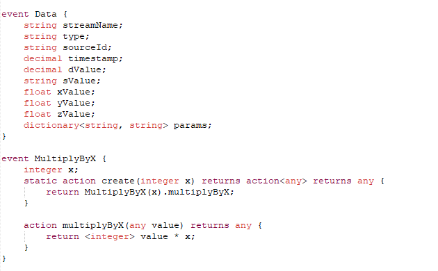

# [EPL](http://www.apamacommunity.com/) Syntax Highlighter for [Notepad++](https://notepad-plus-plus.org)

## Installation Instructions

1. Download the userDefineLang_ApamaEPL.xml (from the [Releases Area](https://github.com/rpeach-sag/apama-notepad-syntax/releases))
2. Open Notepad++
3. In the top menu select `Language`, scroll to the bottom of the list, select `User Defined Language`
4. In the User Defined Language Window, click `Import...` and select the downloaded xml file
5. Close the window

**Note:** After installation you may need to re-open any .mon files.

------------------------------

These tools are provided as-is and without warranty or support. They do not constitute part of the Software AG product suite. Users are free to use, fork and modify them, subject to the license agreement. While Software AG welcomes contributions, we cannot guarantee to include every contribution in the master project.
